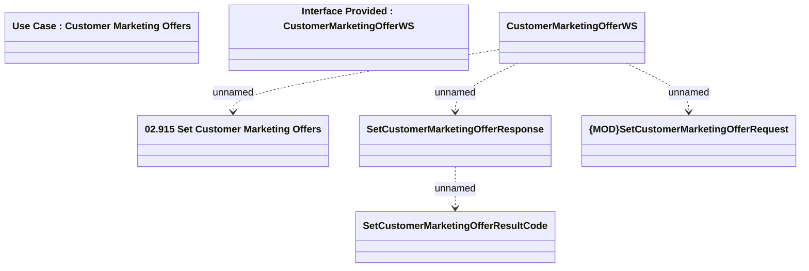

# CustomerMarketingOfferWS - SetCustomerMarketingOffer

- **Diagram Type**: Logical
- **Package**: HomerSelect/BSL/Modules/Marketing Offer/Analytical Model/Marketing Offers Data Source/Marketing Offers Data Source (common)/Interface Provided/CustomerMarketingOfferWS.SetCustomerMarketingOffer
- **Diagram ID**: 111673
- **Elements**: 7
- **Connectors**: 4

