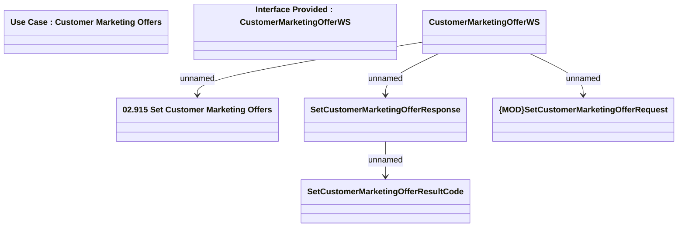

# CustomerMarketingOfferWS - SetCustomerMarketingOffer

```mermaid
classDiagram
    class SetCustomerMarketingOfferResultCode["SetCustomerMarketingOfferResultCode"]
    class n_02_915_Set_Customer_Marketing_Offers["02.915 Set Customer Marketing Offers"]
    class SetCustomerMarketingOfferResponse["SetCustomerMarketingOfferResponse"]
    class MOD_SetCustomerMarketingOfferRequest["{MOD}SetCustomerMarketingOfferRequest"]
    class Use_Case_Customer_Marketing_Offers["Use Case : Customer Marketing Offers"]
    class Interface_Provided_CustomerMarketingOfferWS["Interface Provided : CustomerMarketingOfferWS"]
    class CustomerMarketingOfferWS["CustomerMarketingOfferWS"]
    SetCustomerMarketingOfferResponse --> SetCustomerMarketingOfferResultCode : unnamed
    CustomerMarketingOfferWS --> SetCustomerMarketingOfferResponse : unnamed
    CustomerMarketingOfferWS --> MOD_SetCustomerMarketingOfferRequest : unnamed
    CustomerMarketingOfferWS --> n_02_915_Set_Customer_Marketing_Offers : unnamed
```
