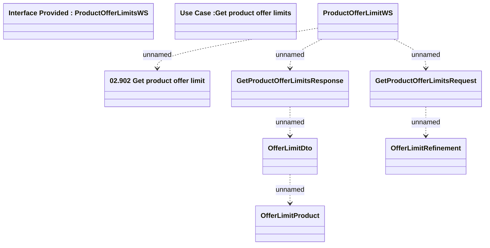

# ProductOfferLimitsWS - GetProductOfferLimits

- **Diagram Type**: Logical
- **Package**: HomerSelect/BSL/Modules/Marketing Offer/Analytical Model/Marketing Offers Data Source/Marketing Offers Data Source (common)/Interface Provided/ProductOfferLimitsWS.GetProductOfferLimits
- **Diagram ID**: 111667
- **Elements**: 9
- **Connectors**: 6

