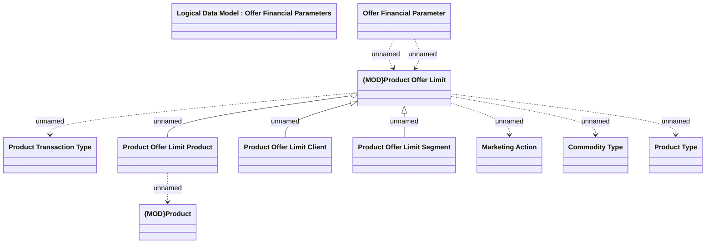

# Product Offer Limit

- **Diagram Type**: Logical
- **Package**: HomerSelect/BSL/Modules/Marketing Offer/Analytical Model/Marketing Offers Data Source/Product Offer Limits (internal DB)/Logical Data Model
- **Diagram ID**: 111663
- **Elements**: 11
- **Connectors**: 10

