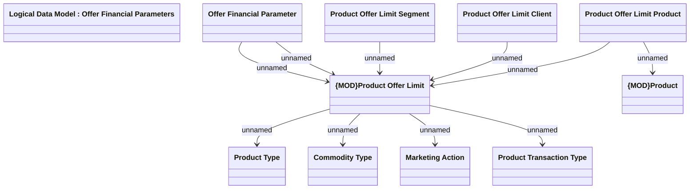

# Product Offer Limit

```mermaid
classDiagram
    class Logical_Data_Model_Offer_Financial_Parameters["Logical Data Model : Offer Financial Parameters"]
    class Product_Transaction_Type["Product Transaction Type"]
    class Product_Offer_Limit_Product["Product Offer Limit Product"]
    class Product_Offer_Limit_Client["Product Offer Limit Client"]
    class Product_Offer_Limit_Segment["Product Offer Limit Segment"]
    class Offer_Financial_Parameter["Offer Financial Parameter"]
    class Marketing_Action["Marketing Action"]
    class Commodity_Type["Commodity Type"]
    class MOD_Product_Offer_Limit["{MOD}Product Offer Limit"]
    class MOD_Product["{MOD}Product"]
    class Product_Type["Product Type"]
    MOD_Product_Offer_Limit --> Product_Type : unnamed
    Product_Offer_Limit_Product --> MOD_Product : unnamed
    Product_Offer_Limit_Product --> MOD_Product_Offer_Limit : unnamed
    Product_Offer_Limit_Client --> MOD_Product_Offer_Limit : unnamed
    Product_Offer_Limit_Segment --> MOD_Product_Offer_Limit : unnamed
    Offer_Financial_Parameter --> MOD_Product_Offer_Limit : unnamed
    MOD_Product_Offer_Limit --> Commodity_Type : unnamed
    MOD_Product_Offer_Limit --> Marketing_Action : unnamed
    MOD_Product_Offer_Limit --> Product_Transaction_Type : unnamed
    Offer_Financial_Parameter --> MOD_Product_Offer_Limit : unnamed
```
