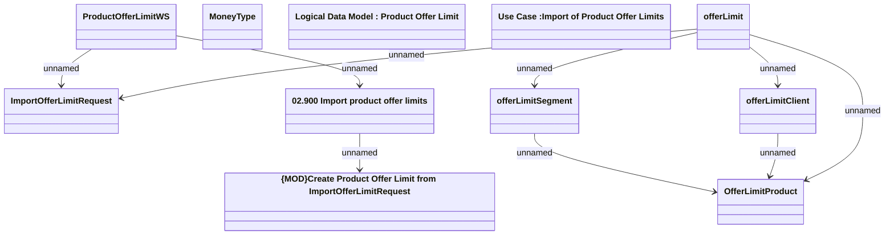

# ProductOfferLimitsWS - ImportOfferLimits method

```mermaid
classDiagram
    class MOD_Create_Product_Offer_Limit_from_ImportOfferLimitRequest["{MOD}Create Product Offer Limit from ImportOfferLimitRequest"]
    class ProductOfferLimitWS["ProductOfferLimitWS"]
    class OfferLimitProduct["OfferLimitProduct"]
    class MoneyType["MoneyType"]
    class ImportOfferLimitRequest["ImportOfferLimitRequest"]
    class Logical_Data_Model_Product_Offer_Limit["Logical Data Model : Product Offer Limit"]
    class Use_Case_Import_of_Product_Offer_Limits["Use Case :Import of Product Offer Limits"]
    class n_02_900_Import_product_offer_limits["02.900 Import product offer limits"]
    class offerLimitSegment["offerLimitSegment"]
    class offerLimitClient["offerLimitClient"]
    class offerLimit["offerLimit"]
    offerLimit --> offerLimitClient : unnamed
    offerLimit --> offerLimitSegment : unnamed
    offerLimit --> ImportOfferLimitRequest : unnamed
    offerLimit --> OfferLimitProduct : unnamed
    offerLimitClient --> OfferLimitProduct : unnamed
    offerLimitSegment --> OfferLimitProduct : unnamed
    n_02_900_Import_product_offer_limits --> MOD_Create_Product_Offer_Limit_from_ImportOfferLimitRequest : unnamed
    ProductOfferLimitWS --> n_02_900_Import_product_offer_limits : unnamed
    ProductOfferLimitWS --> ImportOfferLimitRequest : unnamed
```
