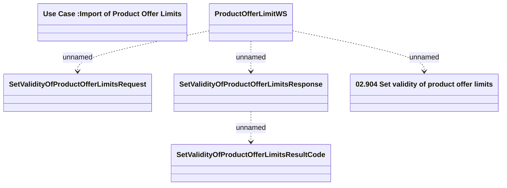

# ProductOfferLimitsWS - SetValidityOfProductOfferLimits method

- **Diagram Type**: Logical
- **Package**: HomerSelect/BSL/Modules/Marketing Offer/Analytical Model/Marketing Offers Data Source/Product Offer Limits (internal DB)/Interface Provided/ProductOfferLimitsWS.SetValidityOfProductOfferLimits
- **Diagram ID**: 90331
- **Elements**: 6
- **Connectors**: 4

