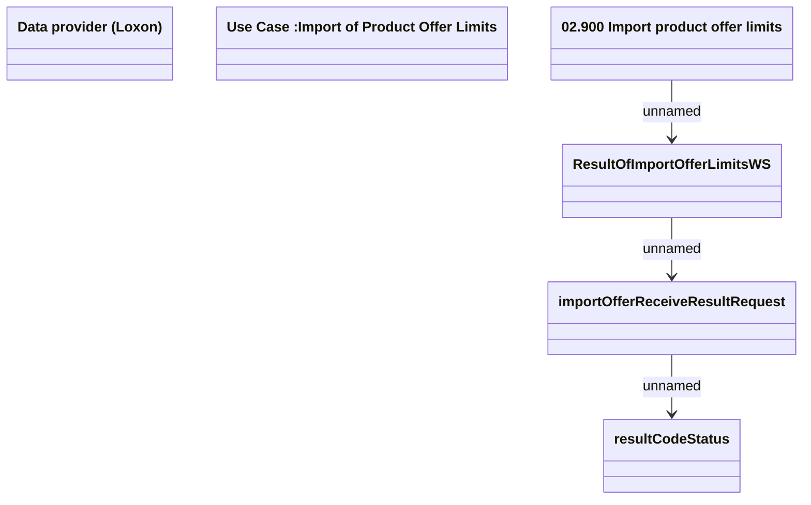

# ResponseOfImportOfferLimitsWS

```mermaid
classDiagram
    class importOfferReceiveResultRequest["importOfferReceiveResultRequest"]
    class resultCodeStatus["resultCodeStatus"]
    class Data_provider_Loxon["Data provider (Loxon)"]
    class Use_Case_Import_of_Product_Offer_Limits["Use Case :Import of Product Offer Limits"]
    class n_02_900_Import_product_offer_limits["02.900 Import product offer limits"]
    class ResultOfImportOfferLimitsWS["ResultOfImportOfferLimitsWS"]
    importOfferReceiveResultRequest --> resultCodeStatus : unnamed
    ResultOfImportOfferLimitsWS --> importOfferReceiveResultRequest : unnamed
    n_02_900_Import_product_offer_limits --> ResultOfImportOfferLimitsWS : unnamed
```
