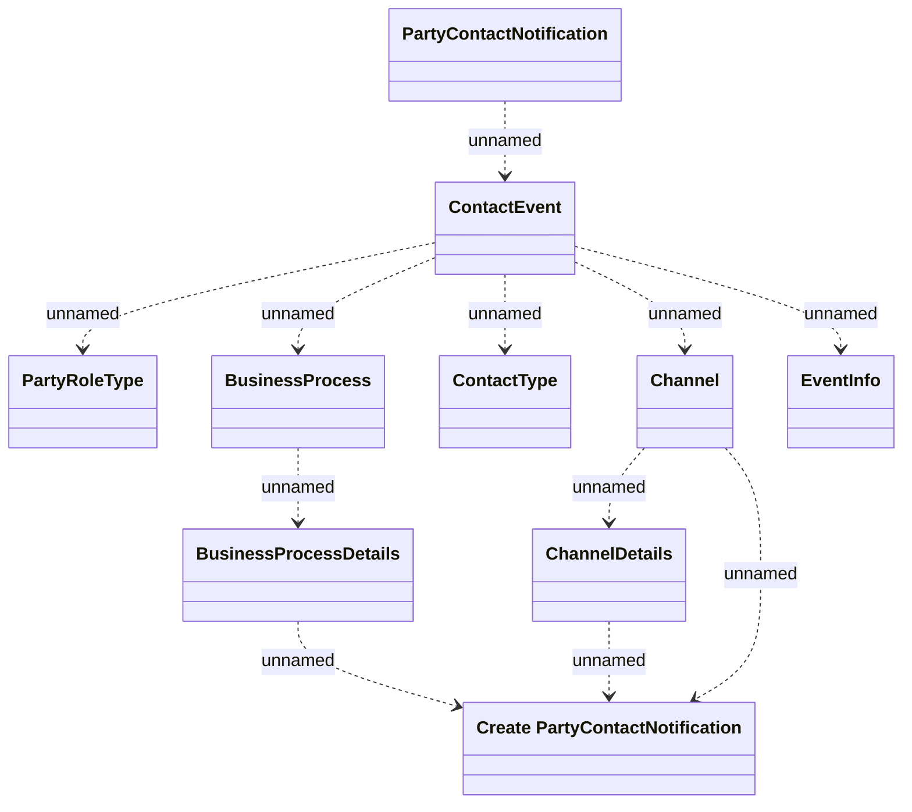

# PartyContactNotification

- **Diagram Type**: Logical
- **Package**: HomerSelect/BSL/Modules/Marketing Offer/Analytical Model/Marketing Offers Recalculation/Notifications/PartyContactNotification
- **Diagram ID**: 130110
- **Elements**: 10
- **Connectors**: 11

