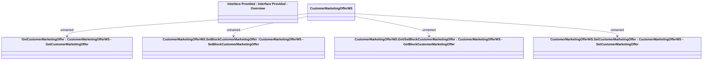

# CustomerMarketingOfferWS

```mermaid
classDiagram
    class CustomerMarketingOfferWS_SetCustomerMarketingOffer_CustomerM["CustomerMarketingOfferWS.SetCustomerMarketingOffer : CustomerMarketingOfferWS - SetCustomerMarketingOffer"]
    class Interface_Provided_Interface_Provided_Overview["Interface Provided : Interface Provided - Overview"]
    class CustomerMarketingOfferWS_Get_SetBlockCustomerMarketingOffer_["CustomerMarketingOfferWS.Get/SetBlockCustomerMarketingOffer : CustomerMarketingOfferWS - GetBlockCustomerMarketingOffer"]
    class CustomerMarketingOfferWS_SetBlockCustomerMarketingOffer_Cust["CustomerMarketingOfferWS.SetBlockCustomerMarketingOffer :CustomerMarketingOfferWS - SetBlockCustomerMarketingOffer"]
    class GetCustomerMarketingOffer_CustomerMarketingOfferWS_GetCustom["GetCustomerMarketingOffer : CustomerMarketingOfferWS - GetCustomerMarketingOffer"]
    class CustomerMarketingOfferWS["CustomerMarketingOfferWS"]
    CustomerMarketingOfferWS --> GetCustomerMarketingOffer_CustomerMarketingOfferWS_GetCustom : unnamed
    CustomerMarketingOfferWS --> CustomerMarketingOfferWS_SetBlockCustomerMarketingOffer_Cust : unnamed
    CustomerMarketingOfferWS --> CustomerMarketingOfferWS_Get_SetBlockCustomerMarketingOffer_ : unnamed
    CustomerMarketingOfferWS --> CustomerMarketingOfferWS_SetCustomerMarketingOffer_CustomerM : unnamed
```
