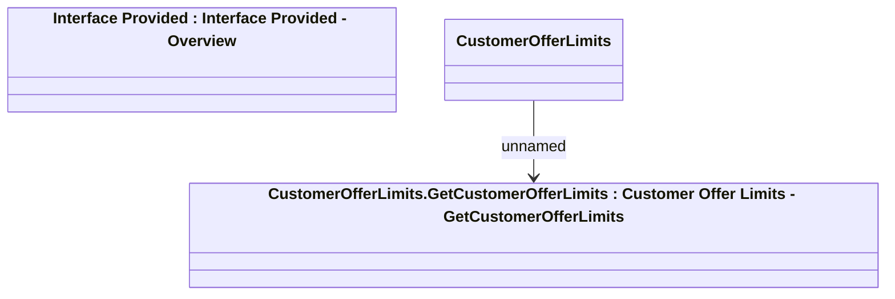

# CustomerOfferLimits (OpenAPI)

- **Diagram Type**: Logical
- **Package**: HomerSelect/BSL/Modules/Marketing Offer/Interface Provided
- **Diagram ID**: 114807
- **Elements**: 3
- **Connectors**: 1

