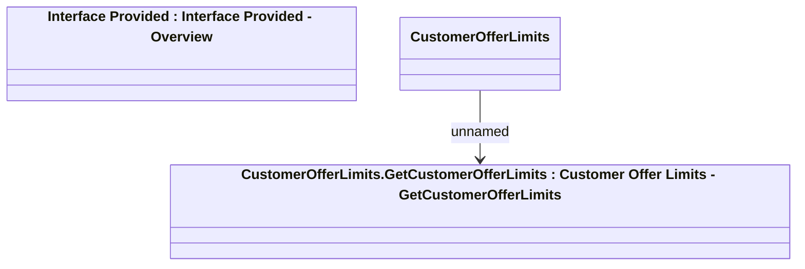

# CustomerOfferLimits (OpenAPI)

```mermaid
classDiagram
    class Interface_Provided_Interface_Provided_Overview["Interface Provided : Interface Provided - Overview"]
    class CustomerOfferLimits_GetCustomerOfferLimits_Customer_Offer_Li["CustomerOfferLimits.GetCustomerOfferLimits : Customer Offer Limits - GetCustomerOfferLimits"]
    class CustomerOfferLimits["CustomerOfferLimits"]
    CustomerOfferLimits --> CustomerOfferLimits_GetCustomerOfferLimits_Customer_Offer_Li : unnamed
```
