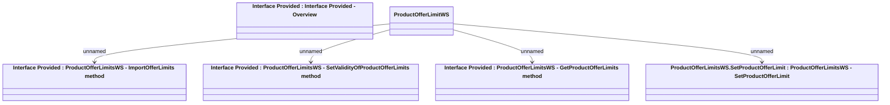

# ProductOfferLimitsWS

```mermaid
classDiagram
    class ProductOfferLimitsWS_SetProductOfferLimit_ProductOfferLimits["ProductOfferLimitsWS.SetProductOfferLimit : ProductOfferLimitsWS - SetProductOfferLimit"]
    class Interface_Provided_Interface_Provided_Overview["Interface Provided : Interface Provided - Overview"]
    class Interface_Provided_ProductOfferLimitsWS_GetProductOfferLimit["Interface Provided : ProductOfferLimitsWS - GetProductOfferLimits method"]
    class Interface_Provided_ProductOfferLimitsWS_SetValidityOfProduct["Interface Provided : ProductOfferLimitsWS - SetValidityOfProductOfferLimits method"]
    class Interface_Provided_ProductOfferLimitsWS_ImportOfferLimits_me["Interface Provided : ProductOfferLimitsWS - ImportOfferLimits method"]
    class ProductOfferLimitWS["ProductOfferLimitWS"]
    ProductOfferLimitWS --> Interface_Provided_ProductOfferLimitsWS_ImportOfferLimits_me : unnamed
    ProductOfferLimitWS --> Interface_Provided_ProductOfferLimitsWS_SetValidityOfProduct : unnamed
    ProductOfferLimitWS --> Interface_Provided_ProductOfferLimitsWS_GetProductOfferLimit : unnamed
    ProductOfferLimitWS --> ProductOfferLimitsWS_SetProductOfferLimit_ProductOfferLimits : unnamed
```
