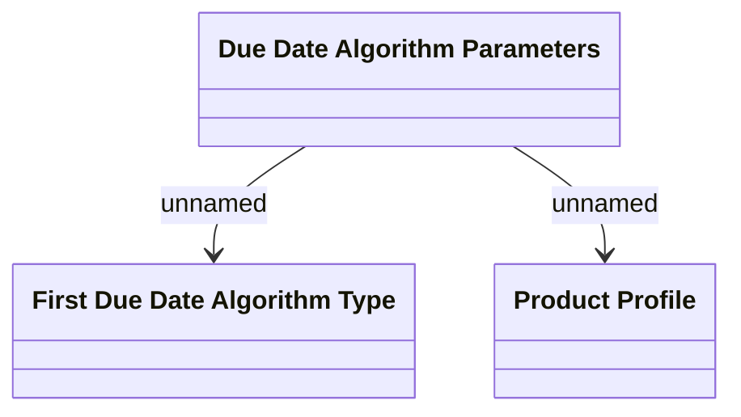

# Due date calculation parameters

```mermaid
classDiagram
    class Product_Profile["Product Profile"]
    class First_Due_Date_Algorithm_Type["First Due Date Algorithm Type"]
    class Due_Date_Algorithm_Parameters["Due Date Algorithm Parameters"]
    Due_Date_Algorithm_Parameters --> First_Due_Date_Algorithm_Type : unnamed
    Due_Date_Algorithm_Parameters --> Product_Profile : unnamed
```
