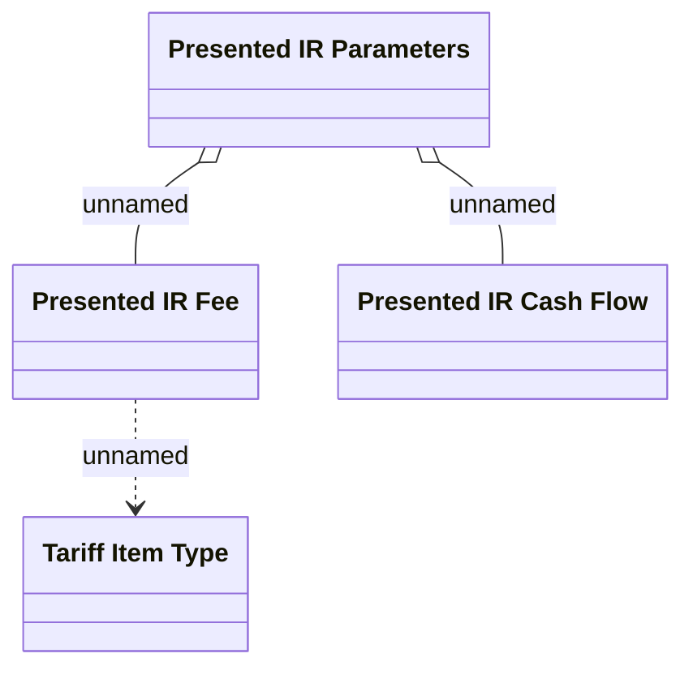

# Presented interest rate - Interface

- **Diagram Type**: Logical
- **Package**: HomerSelect/BSL/Modules/Product Calculator/Analytical Model/Presented Interest Rates/Logical Data Model
- **Diagram ID**: 155745
- **Elements**: 4
- **Connectors**: 3

