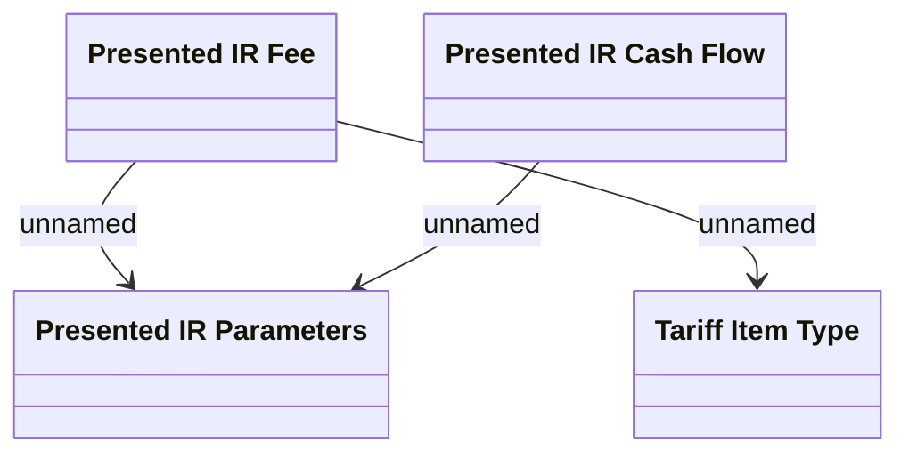

# Presented interest rate - Interface

```mermaid
classDiagram
    class Tariff_Item_Type["Tariff Item Type"]
    class Presented_IR_Fee["Presented IR Fee"]
    class Presented_IR_Cash_Flow["Presented IR Cash Flow"]
    class Presented_IR_Parameters["Presented IR Parameters"]
    Presented_IR_Fee --> Presented_IR_Parameters : unnamed
    Presented_IR_Cash_Flow --> Presented_IR_Parameters : unnamed
    Presented_IR_Fee --> Tariff_Item_Type : unnamed
```
