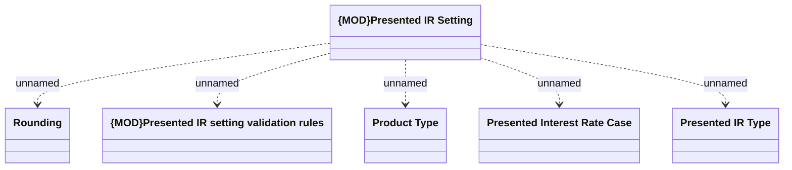

# Presented interest rate - Setting

- **Diagram Type**: Logical
- **Package**: HomerSelect/BSL/Modules/Product Calculator/Analytical Model/Presented Interest Rates/Logical Data Model
- **Diagram ID**: 155744
- **Elements**: 6
- **Connectors**: 5

