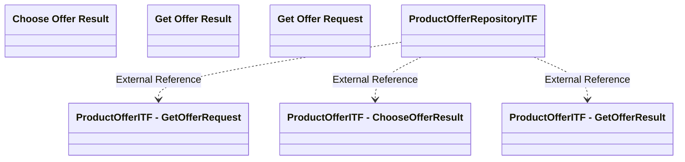

# ProductOfferRepositoryITF

- **Diagram Type**: Logical
- **Package**: HomerSelect/BSL/Modules/Product Calculator/Analytical Model/Product Offer Repository/Interface Provided/ProductOfferITF
- **Diagram ID**: 92881
- **Elements**: 7
- **Connectors**: 3

