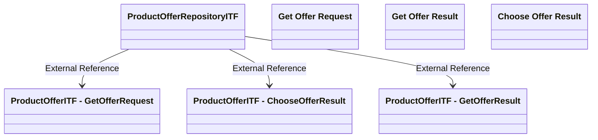

# ProductOfferRepositoryITF

```mermaid
classDiagram
    class ProductOfferITF_GetOfferResult["ProductOfferITF - GetOfferResult"]
    class ProductOfferITF_ChooseOfferResult["ProductOfferITF - ChooseOfferResult"]
    class ProductOfferITF_GetOfferRequest["ProductOfferITF - GetOfferRequest"]
    class ProductOfferRepositoryITF["ProductOfferRepositoryITF"]
    class Get_Offer_Request["Get Offer Request"]
    class Get_Offer_Result["Get Offer Result"]
    class Choose_Offer_Result["Choose Offer Result"]
    ProductOfferRepositoryITF --> ProductOfferITF_GetOfferRequest : External Reference
    ProductOfferRepositoryITF --> ProductOfferITF_ChooseOfferResult : External Reference
    ProductOfferRepositoryITF --> ProductOfferITF_GetOfferResult : External Reference
```
