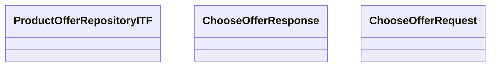

# ProductOfferITF - ChooseOfferResult

- **Diagram Type**: Logical
- **Package**: HomerSelect/BSL/Modules/Product Calculator/Analytical Model/Product Offer Repository/Interface Provided/ProductOfferITF/ChooseOfferResult
- **Diagram ID**: 92891
- **Elements**: 4
- **Connectors**: 0

