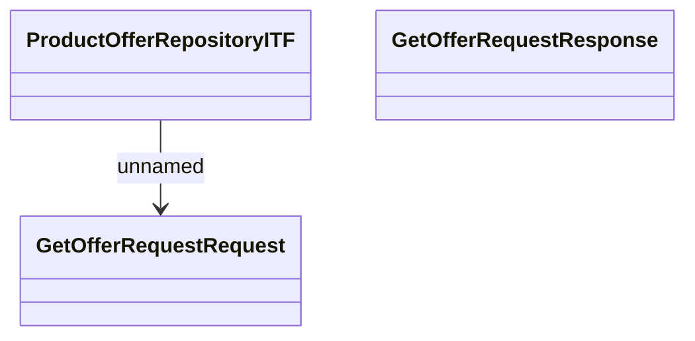

# ProductOfferITF - GetOfferRequest

- **Diagram Type**: Logical
- **Package**: HomerSelect/BSL/Modules/Product Calculator/Analytical Model/Product Offer Repository/Interface Provided/ProductOfferITF/GetOfferRequest
- **Diagram ID**: 92892
- **Elements**: 4
- **Connectors**: 1

