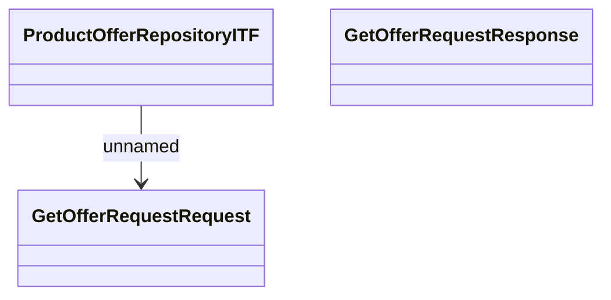

# ProductOfferITF - GetOfferRequest

```mermaid
classDiagram
    class ProductOfferRepositoryITF["ProductOfferRepositoryITF"]
    class GetOfferRequestResponse["GetOfferRequestResponse"]
    class GetOfferRequestRequest["GetOfferRequestRequest"]
    class ProductOfferRepositoryITF["ProductOfferRepositoryITF"]
    ProductOfferRepositoryITF --> GetOfferRequestRequest : unnamed
```
