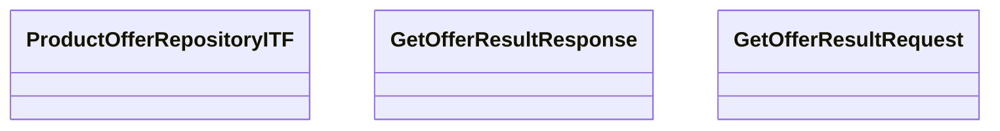

# ProductOfferITF - GetOfferResult

- **Diagram Type**: Logical
- **Package**: HomerSelect/BSL/Modules/Product Calculator/Analytical Model/Product Offer Repository/Interface Provided/ProductOfferITF/GetOfferResult
- **Diagram ID**: 92893
- **Elements**: 4
- **Connectors**: 0

