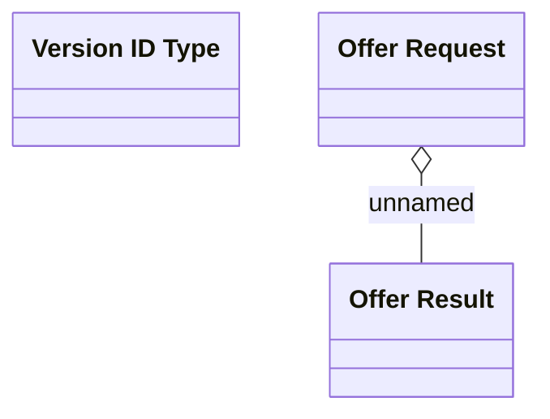

# Offer Repository

- **Diagram Type**: Logical
- **Package**: HomerSelect/BSL/Modules/Product Calculator/Analytical Model/Product Offer Repository/Logical Data Model
- **Diagram ID**: 93534
- **Elements**: 5
- **Connectors**: 1

