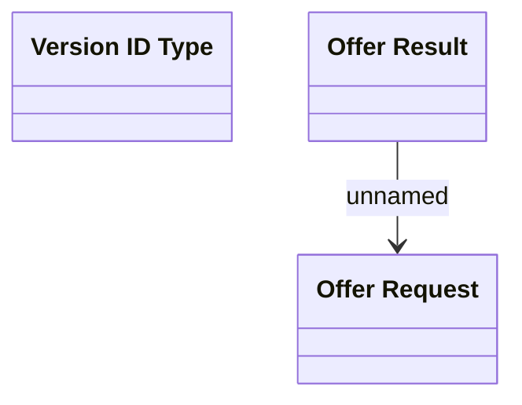

# Offer Repository

```mermaid
classDiagram
    class Version_ID_Type["Version ID Type"]
    class Offer_Request["Offer Request"]
    class Offer_Result["Offer Result"]
    class Offer_Result["Offer Result"]
    class Offer_Request["Offer Request"]
    Offer_Result --> Offer_Request : unnamed
```
