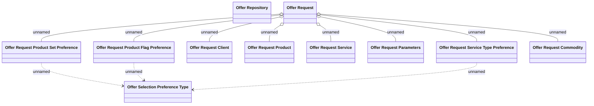

# Offer Request

- **Diagram Type**: Logical
- **Package**: HomerSelect/BSL/Modules/Product Calculator/Analytical Model/Product Offer Repository/Logical Data Model/Request
- **Diagram ID**: 93970
- **Elements**: 12
- **Connectors**: 11

