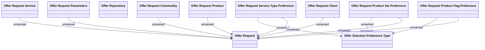

# Offer Request

```mermaid
classDiagram
    class Offer_Selection_Preference_Type["Offer Selection Preference Type"]
    class Offer_Request_Product_Set_Preference["Offer Request Product Set Preference"]
    class Offer_Request_Product_Flag_Preference["Offer Request Product Flag Preference"]
    class Offer_Repository["Offer Repository"]
    class Offer_Request_Client["Offer Request Client"]
    class Offer_Request_Product["Offer Request Product"]
    class Offer_Request_Service["Offer Request Service"]
    class Offer_Request_Parameters["Offer Request Parameters"]
    class Offer_Request_Service_Type_Preference["Offer Request Service Type Preference"]
    class Offer_Request_Commodity["Offer Request Commodity"]
    class Offer_Request["Offer Request"]
    Offer_Request_Product_Flag_Preference --> Offer_Request : unnamed
    Offer_Request_Client --> Offer_Request : unnamed
    Offer_Request_Product --> Offer_Request : unnamed
    Offer_Request_Product_Set_Preference --> Offer_Request : unnamed
    Offer_Request_Service_Type_Preference --> Offer_Request : unnamed
    Offer_Request_Commodity --> Offer_Request : unnamed
    Offer_Request_Parameters --> Offer_Request : unnamed
    Offer_Request_Service --> Offer_Request : unnamed
    Offer_Request_Product_Set_Preference --> Offer_Selection_Preference_Type : unnamed
    Offer_Request_Product_Flag_Preference --> Offer_Selection_Preference_Type : unnamed
    Offer_Request_Service_Type_Preference --> Offer_Selection_Preference_Type : unnamed
```
