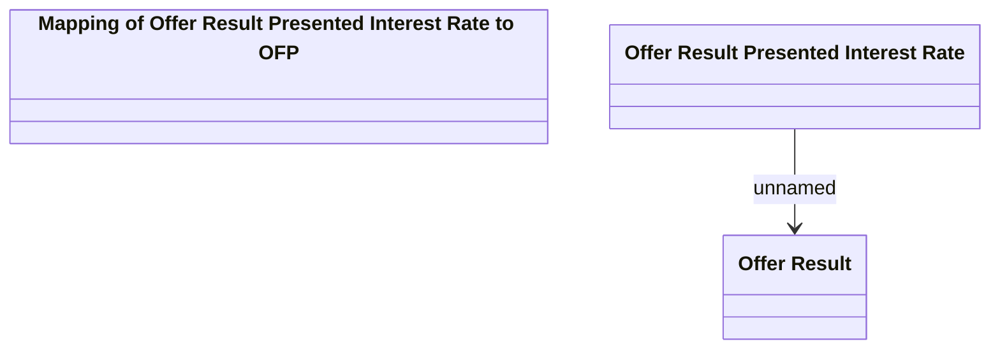

# Offer Result Presented Interest Rate

```mermaid
classDiagram
    class Mapping_of_Offer_Result_Presented_Interest_Rate_to_OFP["Mapping of Offer Result Presented Interest Rate to OFP"]
    class Offer_Result_Presented_Interest_Rate["Offer Result Presented Interest Rate"]
    class Offer_Result["Offer Result"]
    class Offer_Result["Offer Result"]
    Offer_Result_Presented_Interest_Rate --> Offer_Result : unnamed
```
