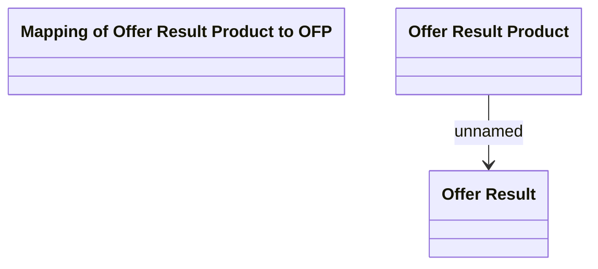

# Offer Result Product

```mermaid
classDiagram
    class Mapping_of_Offer_Result_Product_to_OFP["Mapping of Offer Result Product to OFP"]
    class Offer_Result["Offer Result"]
    class Offer_Result_Product["Offer Result Product"]
    class Offer_Result["Offer Result"]
    Offer_Result_Product --> Offer_Result : unnamed
```
