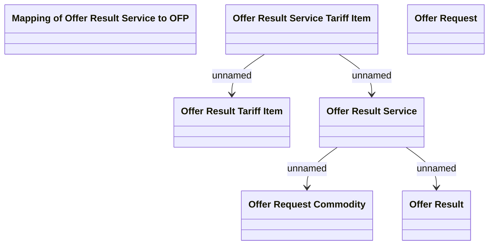

# Offer Result Service

```mermaid
classDiagram
    class Mapping_of_Offer_Result_Service_to_OFP["Mapping of Offer Result Service to OFP"]
    class Offer_Result_Tariff_Item["Offer Result Tariff Item"]
    class Offer_Result_Service_Tariff_Item["Offer Result Service Tariff Item"]
    class Offer_Result_Tariff_Item["Offer Result Tariff Item"]
    class Offer_Request["Offer Request"]
    class Offer_Result["Offer Result"]
    class Offer_Result["Offer Result"]
    class Offer_Request_Commodity["Offer Request Commodity"]
    class Offer_Result_Service["Offer Result Service"]
    Offer_Result_Service_Tariff_Item --> Offer_Result_Service : unnamed
    Offer_Result_Service --> Offer_Request_Commodity : unnamed
    Offer_Result_Service --> Offer_Result : unnamed
    Offer_Result_Service_Tariff_Item --> Offer_Result_Tariff_Item : unnamed
```
