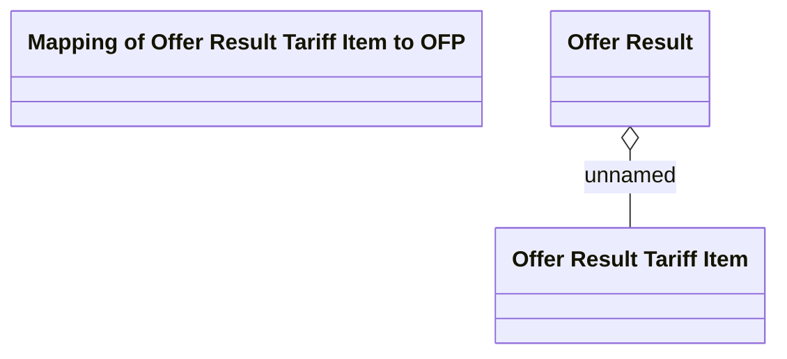

# Offer Result Tariff Item

- **Diagram Type**: Logical
- **Package**: HomerSelect/BSL/Modules/Product Calculator/Analytical Model/Product Offer Repository/Logical Data Model/Result
- **Diagram ID**: 94206
- **Elements**: 4
- **Connectors**: 1

