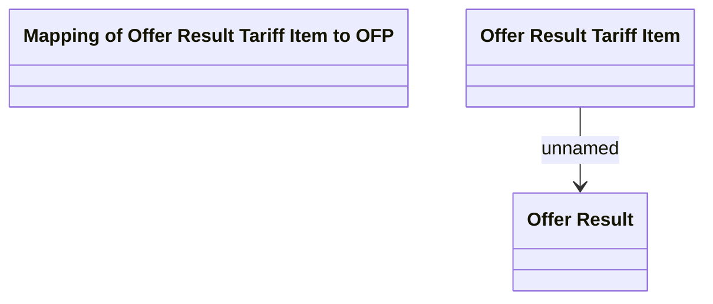

# Offer Result Tariff Item

```mermaid
classDiagram
    class Mapping_of_Offer_Result_Tariff_Item_to_OFP["Mapping of Offer Result Tariff Item to OFP"]
    class Offer_Result["Offer Result"]
    class Offer_Result["Offer Result"]
    class Offer_Result_Tariff_Item["Offer Result Tariff Item"]
    Offer_Result_Tariff_Item --> Offer_Result : unnamed
```
