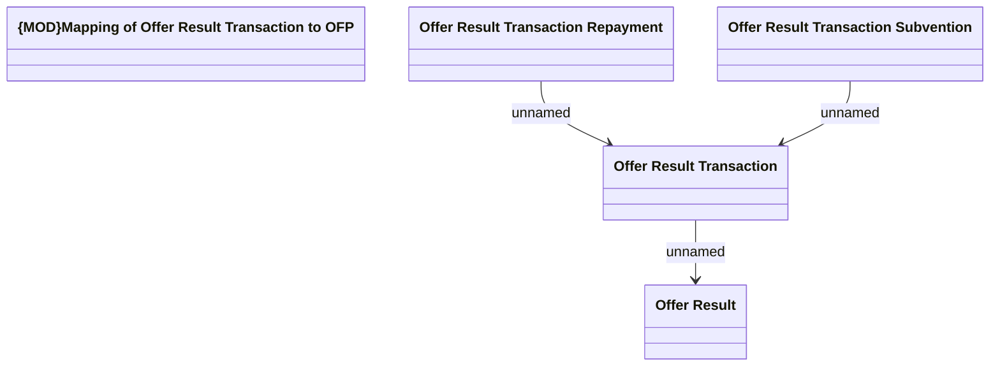

# Offer Result Transaction

```mermaid
classDiagram
    class MOD_Mapping_of_Offer_Result_Transaction_to_OFP["{MOD}Mapping of Offer Result Transaction to OFP"]
    class Offer_Result_Transaction_Repayment["Offer Result Transaction Repayment"]
    class Offer_Result["Offer Result"]
    class Offer_Result_Transaction_Subvention["Offer Result Transaction Subvention"]
    class Offer_Result_Transaction["Offer Result Transaction"]
    class Offer_Result["Offer Result"]
    Offer_Result_Transaction_Repayment --> Offer_Result_Transaction : unnamed
    Offer_Result_Transaction_Subvention --> Offer_Result_Transaction : unnamed
    Offer_Result_Transaction --> Offer_Result : unnamed
```
