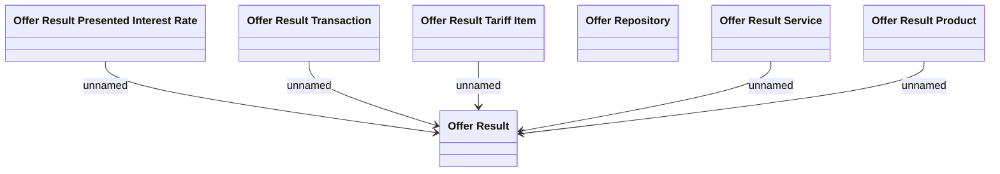

# Offer Result

```mermaid
classDiagram
    class Offer_Result_Presented_Interest_Rate["Offer Result Presented Interest Rate"]
    class Offer_Result_Presented_Interest_Rate["Offer Result Presented Interest Rate"]
    class Offer_Result_Product["Offer Result Product"]
    class Offer_Result_Transaction["Offer Result Transaction"]
    class Offer_Repository["Offer Repository"]
    class Offer_Result_Tariff_Item["Offer Result Tariff Item"]
    class Offer_Result_Service["Offer Result Service"]
    class Offer_Result_Transaction["Offer Result Transaction"]
    class Offer_Result_Tariff_Item["Offer Result Tariff Item"]
    class Offer_Result_Service["Offer Result Service"]
    class Offer_Result_Product["Offer Result Product"]
    class Offer_Result["Offer Result"]
    Offer_Result_Presented_Interest_Rate --> Offer_Result : unnamed
    Offer_Result_Transaction --> Offer_Result : unnamed
    Offer_Result_Tariff_Item --> Offer_Result : unnamed
    Offer_Result_Service --> Offer_Result : unnamed
    Offer_Result_Product --> Offer_Result : unnamed
```
