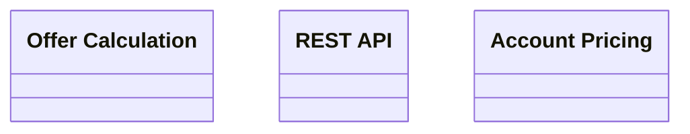

# Account Pricing API

- **Diagram Type**: Logical
- **Package**: HomerSelect/BSL/Modules/Product Calculator/Interface Consumed/Account Pricing API
- **Diagram ID**: 142883
- **Elements**: 3
- **Connectors**: 0

