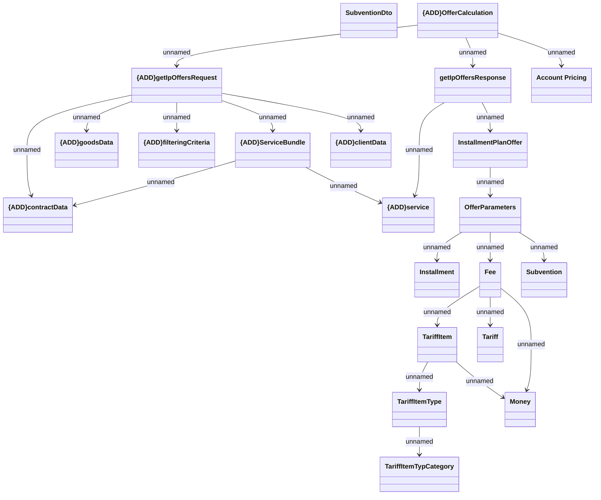

# Offer Calculation

```mermaid
classDiagram
    class SubventionDto["SubventionDto"]
    class Installment["Installment"]
    class TariffItemTypCategory["TariffItemTypCategory"]
    class TariffItemType["TariffItemType"]
    class TariffItem["TariffItem"]
    class Money["Money"]
    class ADD_contractData["{ADD}contractData"]
    class Tariff["Tariff"]
    class InstallmentPlanOffer["InstallmentPlanOffer"]
    class ADD_service["{ADD}service"]
    class OfferParameters["OfferParameters"]
    class Fee["Fee"]
    class Subvention["Subvention"]
    class getIpOffersResponse["getIpOffersResponse"]
    class ADD_contractData["{ADD}contractData"]
    class ADD_goodsData["{ADD}goodsData"]
    class ADD_filteringCriteria["{ADD}filteringCriteria"]
    class ADD_ServiceBundle["{ADD}ServiceBundle"]
    class ADD_clientData["{ADD}clientData"]
    class ADD_getIpOffersRequest["{ADD}getIpOffersRequest"]
    class ADD_OfferCalculation["{ADD}OfferCalculation"]
    class Account_Pricing["Account Pricing"]
    InstallmentPlanOffer --> OfferParameters : unnamed
    OfferParameters --> Installment : unnamed
    TariffItemType --> TariffItemTypCategory : unnamed
    TariffItem --> TariffItemType : unnamed
    Fee --> TariffItem : unnamed
    Fee --> Money : unnamed
    TariffItem --> Money : unnamed
    Fee --> Tariff : unnamed
    getIpOffersResponse --> InstallmentPlanOffer : unnamed
    ADD_OfferCalculation --> Account_Pricing : unnamed
    OfferParameters --> Fee : unnamed
    OfferParameters --> Subvention : unnamed
    getIpOffersResponse --> ADD_service : unnamed
    ADD_getIpOffersRequest --> ADD_filteringCriteria : unnamed
    ADD_ServiceBundle --> ADD_contractData : unnamed
    ADD_ServiceBundle --> ADD_service : unnamed
    ADD_OfferCalculation --> getIpOffersResponse : unnamed
    ADD_OfferCalculation --> ADD_getIpOffersRequest : unnamed
    ADD_getIpOffersRequest --> ADD_clientData : unnamed
    ADD_getIpOffersRequest --> ADD_goodsData : unnamed
    ADD_getIpOffersRequest --> ADD_ServiceBundle : unnamed
    ADD_getIpOffersRequest --> ADD_contractData : unnamed
```
