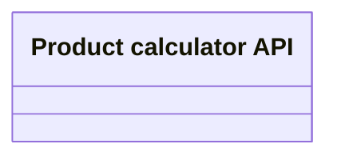

# Product Calculator REST API

- **Diagram Type**: Logical
- **Package**: HomerSelect/BSL/Modules/Product Calculator/Interface Provided/Product Calculator REST API
- **Diagram ID**: 158810
- **Elements**: 1
- **Connectors**: 0

