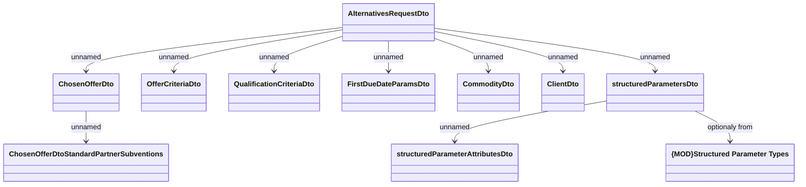

# AlternativesRequest

```mermaid
classDiagram
    class MOD_Structured_Parameter_Types["{MOD}Structured Parameter Types"]
    class structuredParameterAttributesDto["structuredParameterAttributesDto"]
    class structuredParametersDto["structuredParametersDto"]
    class OfferCriteriaDto["OfferCriteriaDto"]
    class QualificationCriteriaDto["QualificationCriteriaDto"]
    class FirstDueDateParamsDto["FirstDueDateParamsDto"]
    class CommodityDto["CommodityDto"]
    class ClientDto["ClientDto"]
    class ChosenOfferDtoStandardPartnerSubventions["ChosenOfferDtoStandardPartnerSubventions"]
    class ChosenOfferDto["ChosenOfferDto"]
    class AlternativesRequestDto["AlternativesRequestDto"]
    AlternativesRequestDto --> ChosenOfferDto : unnamed
    ChosenOfferDto --> ChosenOfferDtoStandardPartnerSubventions : unnamed
    AlternativesRequestDto --> ClientDto : unnamed
    AlternativesRequestDto --> CommodityDto : unnamed
    AlternativesRequestDto --> FirstDueDateParamsDto : unnamed
    AlternativesRequestDto --> QualificationCriteriaDto : unnamed
    AlternativesRequestDto --> OfferCriteriaDto : unnamed
    AlternativesRequestDto --> structuredParametersDto : unnamed
    structuredParametersDto --> structuredParameterAttributesDto : unnamed
    structuredParametersDto --> MOD_Structured_Parameter_Types : optionaly from
```
