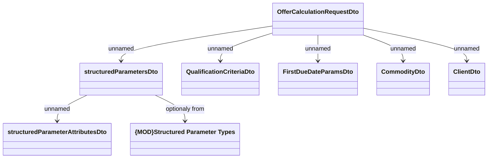

# OfferCalculationRequest

```mermaid
classDiagram
    class MOD_Structured_Parameter_Types["{MOD}Structured Parameter Types"]
    class structuredParameterAttributesDto["structuredParameterAttributesDto"]
    class structuredParametersDto["structuredParametersDto"]
    class QualificationCriteriaDto["QualificationCriteriaDto"]
    class FirstDueDateParamsDto["FirstDueDateParamsDto"]
    class CommodityDto["CommodityDto"]
    class ClientDto["ClientDto"]
    class OfferCalculationRequestDto["OfferCalculationRequestDto"]
    OfferCalculationRequestDto --> ClientDto : unnamed
    OfferCalculationRequestDto --> CommodityDto : unnamed
    OfferCalculationRequestDto --> FirstDueDateParamsDto : unnamed
    OfferCalculationRequestDto --> QualificationCriteriaDto : unnamed
    OfferCalculationRequestDto --> structuredParametersDto : unnamed
    structuredParametersDto --> structuredParameterAttributesDto : unnamed
    structuredParametersDto --> MOD_Structured_Parameter_Types : optionaly from
```
