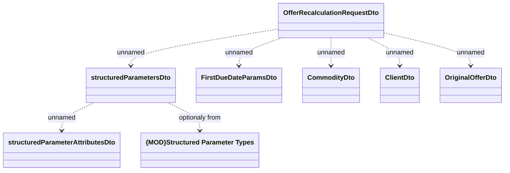

# OfferRecalculationRequest

- **Diagram Type**: Logical
- **Package**: HomerSelect/BSL/Modules/Product Calculator/Interface Provided/Product Calculator REST API/Product Calculator
- **Diagram ID**: 164373
- **Elements**: 8
- **Connectors**: 7

