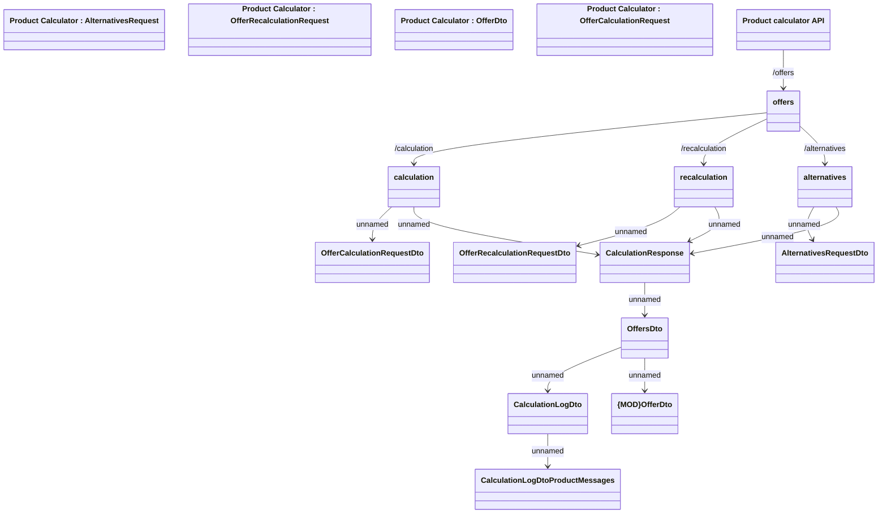

# Product Calculator

```mermaid
classDiagram
    class CalculationResponse["CalculationResponse"]
    class Product_Calculator_AlternativesRequest["Product Calculator : AlternativesRequest"]
    class AlternativesRequestDto["AlternativesRequestDto"]
    class Product_Calculator_OfferRecalculationRequest["Product Calculator : OfferRecalculationRequest"]
    class OfferRecalculationRequestDto["OfferRecalculationRequestDto"]
    class Product_Calculator_OfferDto["Product Calculator : OfferDto"]
    class Product_Calculator_OfferCalculationRequest["Product Calculator : OfferCalculationRequest"]
    class OfferCalculationRequestDto["OfferCalculationRequestDto"]
    class MOD_OfferDto["{MOD}OfferDto"]
    class CalculationLogDtoProductMessages["CalculationLogDtoProductMessages"]
    class CalculationLogDto["CalculationLogDto"]
    class OffersDto["OffersDto"]
    class alternatives["alternatives"]
    class recalculation["recalculation"]
    class calculation["calculation"]
    class offers["offers"]
    class Product_calculator_API["Product calculator API"]
    Product_calculator_API --> offers : /offers
    offers --> calculation : /calculation
    offers --> recalculation : /recalculation
    offers --> alternatives : /alternatives
    CalculationResponse --> OffersDto : unnamed
    OffersDto --> CalculationLogDto : unnamed
    CalculationLogDto --> CalculationLogDtoProductMessages : unnamed
    OffersDto --> MOD_OfferDto : unnamed
    calculation --> OfferCalculationRequestDto : unnamed
    recalculation --> OfferRecalculationRequestDto : unnamed
    alternatives --> AlternativesRequestDto : unnamed
    recalculation --> CalculationResponse : unnamed
    alternatives --> CalculationResponse : unnamed
    calculation --> CalculationResponse : unnamed
```
