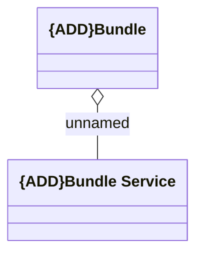

# Logical Data Model

- **Diagram Type**: Logical
- **Package**: HomerSelect/BSL/Modules/Product Catalog (PRC)/Analytical Model/Bundle/COMMON for Bundle/Logical Data Model
- **Diagram ID**: 159854
- **Elements**: 2
- **Connectors**: 1

