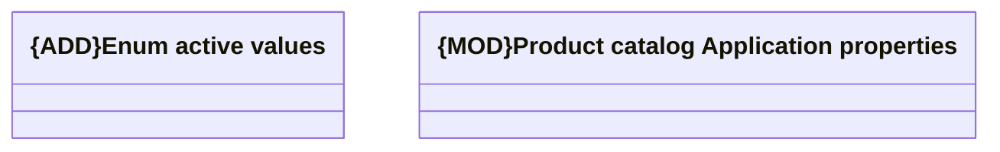

# Application Properties

- **Diagram Type**: Logical
- **Package**: HomerSelect/BSL/Modules/Product Catalog (PRC)/Analytical Model/COMMON for Product Catalog/Application Properties
- **Diagram ID**: 160767
- **Elements**: 2
- **Connectors**: 0

