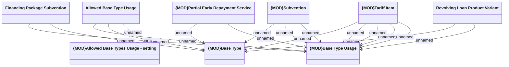

# Base Types

```mermaid
classDiagram
    class MOD_Partial_Early_Repayment_Service["{MOD}Partial Early Repayment Service"]
    class Financing_Package_Subvention["Financing Package Subvention"]
    class MOD_Base_Type["{MOD}Base Type"]
    class Revolving_Loan_Product_Variant["Revolving Loan Product Variant"]
    class Allowed_Base_Type_Usage["Allowed Base Type Usage"]
    class MOD_Base_Type_Usage["{MOD}Base Type Usage"]
    class MOD_Allowed_Base_Types_Usage_setting["{MOD}Allowed Base Types Usage - setting"]
    class MOD_Subvention["{MOD}Subvention"]
    class MOD_Tariff_Item["{MOD}Tariff Item"]
    Allowed_Base_Type_Usage --> MOD_Base_Type_Usage : unnamed
    MOD_Subvention --> MOD_Base_Type : unnamed
    Allowed_Base_Type_Usage --> MOD_Base_Type : unnamed
    MOD_Tariff_Item --> MOD_Base_Type : unnamed
    MOD_Partial_Early_Repayment_Service --> MOD_Base_Type : unnamed
    Allowed_Base_Type_Usage --> MOD_Allowed_Base_Types_Usage_setting : unnamed
    Financing_Package_Subvention --> MOD_Base_Type_Usage : unnamed
    MOD_Tariff_Item --> MOD_Base_Type_Usage : unnamed
    MOD_Tariff_Item --> MOD_Base_Type_Usage : unnamed
    MOD_Subvention --> MOD_Base_Type_Usage : unnamed
    MOD_Tariff_Item --> MOD_Base_Type_Usage : unnamed
    MOD_Tariff_Item --> MOD_Base_Type_Usage : unnamed
    MOD_Partial_Early_Repayment_Service --> MOD_Base_Type_Usage : unnamed
    MOD_Subvention --> MOD_Base_Type_Usage : unnamed
    Financing_Package_Subvention --> MOD_Base_Type : unnamed
    Revolving_Loan_Product_Variant --> MOD_Base_Type : unnamed
    Revolving_Loan_Product_Variant --> MOD_Base_Type_Usage : unnamed
```
