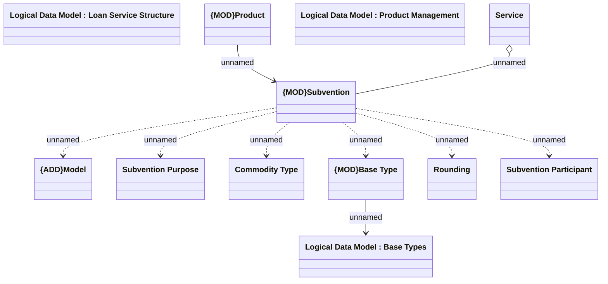

# Subventions

- **Diagram Type**: Logical
- **Package**: HomerSelect/BSL/Modules/Product Catalog (PRC)/Analytical Model/COMMON for Product Catalog/COMMON for Subvention/Logical Data Model
- **Diagram ID**: 162304
- **Elements**: 12
- **Connectors**: 9

