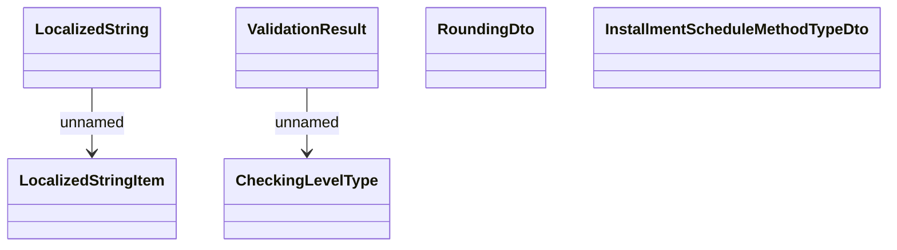

# Product Catalogue Common Types

```mermaid
classDiagram
    class LocalizedString["LocalizedString"]
    class LocalizedStringItem["LocalizedStringItem"]
    class CheckingLevelType["CheckingLevelType"]
    class ValidationResult["ValidationResult"]
    class RoundingDto["RoundingDto"]
    class InstallmentScheduleMethodTypeDto["InstallmentScheduleMethodTypeDto"]
    ValidationResult --> CheckingLevelType : unnamed
    LocalizedString --> LocalizedStringItem : unnamed
```
