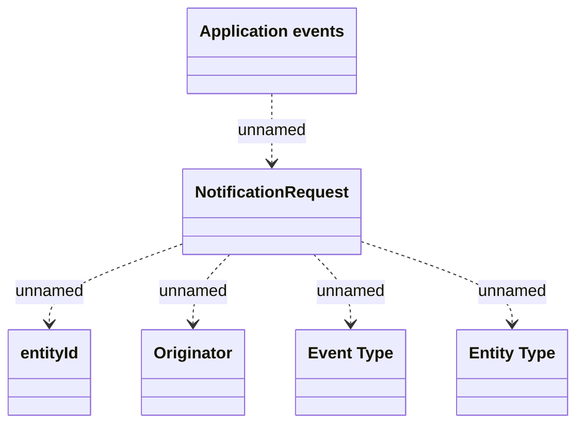

# Notification

- **Diagram Type**: Logical
- **Package**: HomerSelect/BSL/Modules/Product Catalog (PRC)/Analytical Model/COMMON for Product Catalog/Notification
- **Diagram ID**: 162297
- **Elements**: 6
- **Connectors**: 5

