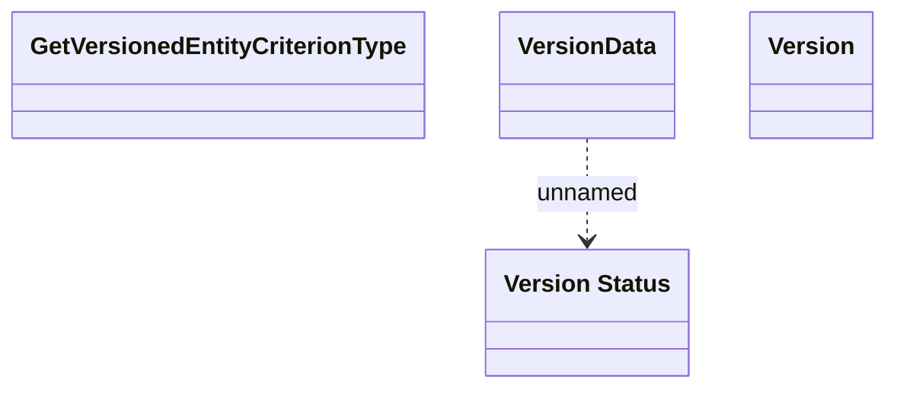

# Versioned entity

- **Diagram Type**: Logical
- **Package**: HomerSelect/BSL/Modules/Product Catalog (PRC)/Analytical Model/COMMON for Product Catalog/Versioned entity/Interface Provided
- **Diagram ID**: 96628
- **Elements**: 4
- **Connectors**: 1

