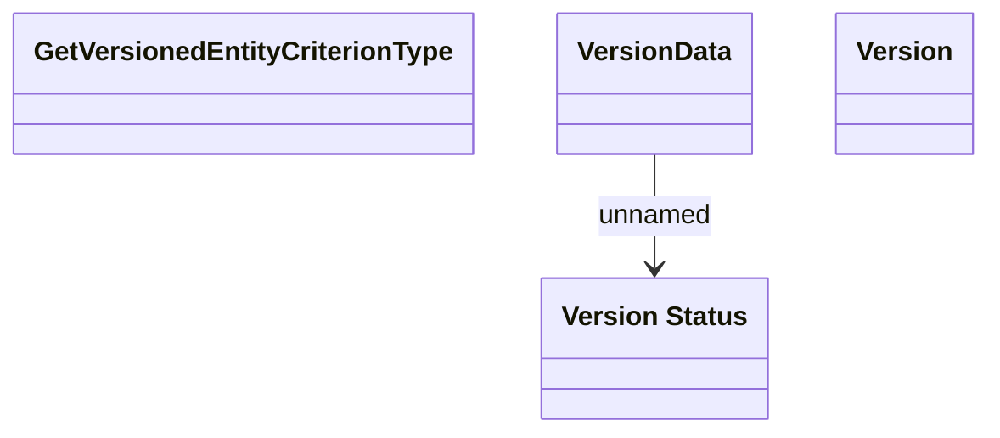

# Versioned entity

```mermaid
classDiagram
    class GetVersionedEntityCriterionType["GetVersionedEntityCriterionType"]
    class Version_Status["Version Status"]
    class VersionData["VersionData"]
    class Version["Version"]
    VersionData --> Version_Status : unnamed
```
