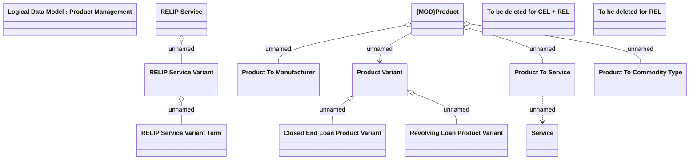

# Entities to be removed

- **Diagram Type**: Logical
- **Package**: HomerSelect/BSL/Modules/Product Catalog (PRC)/Analytical Model/Financing Scheme/Financing Package/Logical Data Model
- **Diagram ID**: 162997
- **Elements**: 14
- **Connectors**: 9

